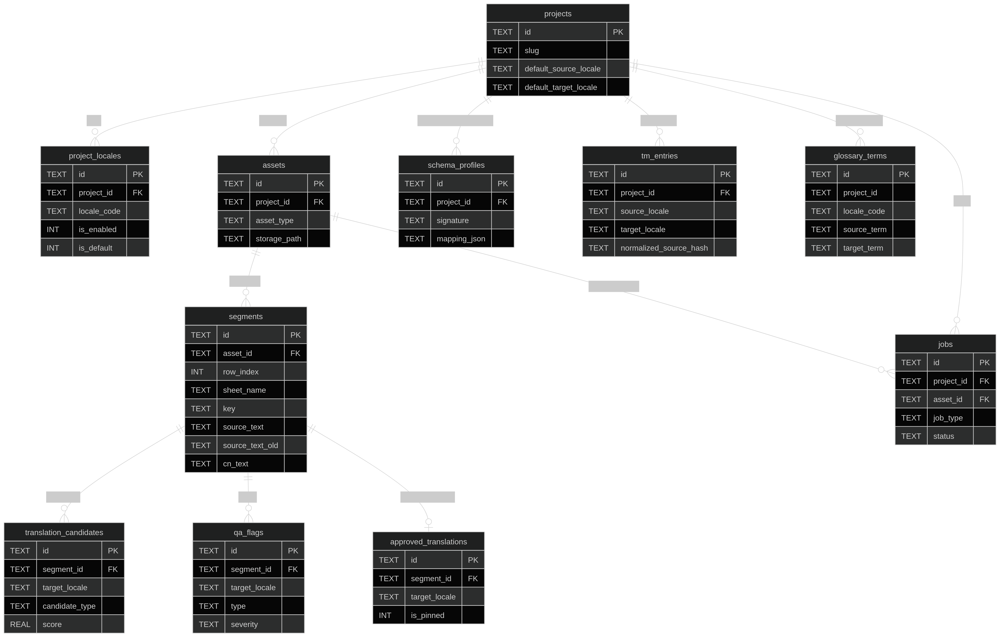

# t-tool (Ticket 1 Walking Skeleton)

This repository provides a local-first foundation for per-project translation tooling.

## Setup

```bash
python -m pip install -e .
```

For tests:

```bash
python -m pip install -e .[dev]
pytest
```

## CLI Usage

Create a project:

```bash
tt create-project "My Game" --source en-US --target de-DE --targets de-DE,fr-FR
```

Show project info:

```bash
tt project-info my-game
```

Optional projects root override:

```bash
tt create-project "Another Game" --root /path/to/projects
```

## Project Folder Structure

```text
projects/<slug>/
  project.db
  imports/
  exports/
  cache/
  config.yml
  README.txt
```

## Run project locally

```bash
  source .venv/bin/activate
  pip install -e ".[dev]"
  streamlit run tt_app/app.py
```

## Notes

- Local-first only: each project has one SQLite DB file in its own folder.
- Schema migrations are versioned via `schema_meta.schema_version`.
- WAL mode is enabled for SQLite connections.
- `config.yml` stores non-secret settings only.
- Secrets (API keys, tokens) are intentionally not stored in SQLite or plaintext config.
- Planned future direction: OS keychain-backed secret handling (Ticket 6+).


## Delete all projects

```bash
rm -rf ./projects
```

```bash
SQLite:
PRAGMA foreign_keys = OFF;
DELETE FROM qa_flags;
DELETE FROM approved_translations;
DELETE FROM translation_candidates;
DELETE FROM jobs;
DELETE FROM segments;
DELETE FROM schema_profiles;
DELETE FROM assets;
DELETE FROM tm_fts;
DELETE FROM tm_entries;
DELETE FROM glossary_terms;
DELETE FROM project_locales;
DELETE FROM projects;
PRAGMA foreign_keys = ON;
VACUUM;
```

DB Tables (Purpose / Meaning)

1) schema_meta
- Database metadata and schema versioning.
- Stores key/value pairs such as schema_version for migrations.

2) projects
- One row per game/project.
- Holds name/slug and default source/target locales.

3) project_locales
- Enabled locales per project (e.g. de-DE, fr-FR).
- Also stores per-locale rules_json and which locale is default.

4) assets
- One row per imported input (xlsx/csv/folder/zip/text_request, etc.).
- Stores filename, source channel, received time, optional file hash, optional local storage_path, size.

5) schema_profiles
- Remembers how to map columns for a file layout.
- signature = hash of sheet/headers/colcount; mapping_json = the role mapping (source/target/cn/key/char_limit/context, etc.).
- Enables “don’t remap every time” via reuse.

6) segments
- The core “strings to translate” table (typically one row per spreadsheet row).
- Stores row_index, sheet_name, key (if any), source_text (NEW/current), optional source_text_old (change-files), cn_text, context_json, char_limit, placeholders_json.

7) translation_candidates
- Draft/suggestions for a segment in a target locale.
- candidate_type examples: existing_target, tm_exact, tm_fuzzy, llm_draft, llm_reviewed, edited, mock.
- Stores score and model_info_json for provenance.

8) approved_translations
- The “final truth” per segment + target locale (upserted).
- Stores final_text, approved_at/by, revision_of_id (version history pointer), is_pinned (lock/pin).

9) qa_flags
- Automated QA findings per segment + target locale.
- Examples: placeholder_changed, glossary_violation, newline_mismatch, too_long, etc.
- Has severity, message, and optional resolution fields.

10) tm_entries
- Translation Memory entries (the ALL-equivalent working store).
- Only learns from approved translations (not drafts).
- Lookup key is normalized_source_hash; includes use_count/last_used_at for ranking.

11) tm_fts  (FTS5 virtual table)
- Full-text search index for tm_entries to quickly retrieve candidates.
- Used to get top matches, then optional fuzzy reranking is applied.

12) tm_fts_data (FTS5 shadow)
- Internal FTS storage table automatically created by SQLite.

13) tm_fts_idx (FTS5 shadow)
- Internal FTS index structure automatically created by SQLite.

14) tm_fts_docsize (FTS5 shadow)
- Internal FTS statistics table automatically created by SQLite.

15) tm_fts_config (FTS5 shadow)
- Internal FTS configuration table automatically created by SQLite.

16) glossary_terms
- Terminology database per project + target locale (and optionally “global” project_id later).
- must-use terms plus matching policy:
  match_type, case_sensitive, allow_compounds, compound_strategy, negative_patterns_json.

17) jobs
- Tracks processing runs (translate asset, change-file processing, media scan, etc.).
- Stores job_type, status, targets_json, timestamps, and decision_trace_json for auditability.

18) sqlite_stat1 / sqlite_sequence / sqlite_schema (SQLite internal; may appear depending on DB state)
- sqlite_stat1: created after ANALYZE, used by query planner.
- sqlite_sequence: only if AUTOINCREMENT is used.
- sqlite_schema: internal catalog view/table shown by tools.

